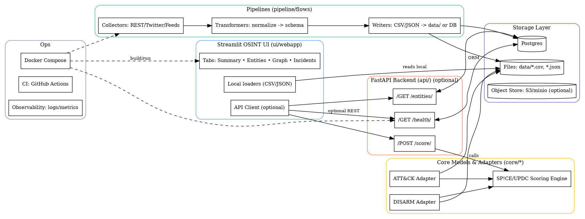

# Project GOS


## Development

Start the stack:

```sh
make up
```

Stop the stack:

```sh
make down
```

Format the code:

```sh
make fmt
```

Run tests:

```sh
make test
```

Run database migrations:

```sh
make migrate
```
## Overview
Project GOS is a modular framework for open-source intelligence (OSINT) and psychological operations simulation. It combines tools like SP!CE and DISARM to support research and experimentation. The Streamlit dashboard serves as the primary entry point to the system, while the data pipelines and REST API can be used as optional add-ons.

## UI Quick Start

1. **Install dependencies**
   ```bash
   poetry install
   ```
2. **Point the UI at your data**
   ```bash
   export GOS_DATA_DIR=path/to/sample-data
   ```
   The dashboard reads from `GOS_DATA_DIR`; you can start with a sample dataset to explore the UI.
3. **Run the dashboard**
   ```bash
   streamlit run ui/webapp/app.py
   ```

Supporting services (e.g., the database) can be started and stopped with the existing Makefile targets:
```bash
make up    # start services
make down  # stop services
```

## Quick Start

### Docker
```bash
docker build -t project-gos .
docker run --rm -p 8000:8000 project-gos
```

### Poetry
```bash
poetry install
poetry run python main.py
```

## DISARM Tactic Registry

The DISARM data set can be synchronised into the local database and queried via
the `DisarmRegistry` utility.  By default, an in-memory SQLite database is used;
set `DATABASE_URL` to override this.  To import tactics, place a `tactics.json`
file in `external/disarm` or specify a custom path with `DISARM_TACTICS_FILE`,
then run:

```bash
python -m core.disarm.sync
```

After syncing, tactics can be searched programmatically:

```python
from core.disarm.registry import DisarmRegistry

reg = DisarmRegistry()
print(reg.search(q="disinformation"))
```

## Architecture


## Contact
For questions or feedback, please open an issue or contact the maintainers at [info@example.com](mailto:info@example.com).

